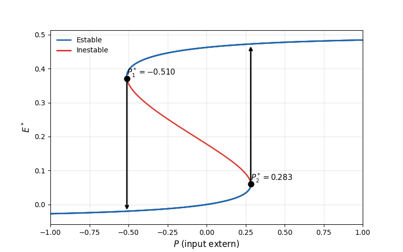
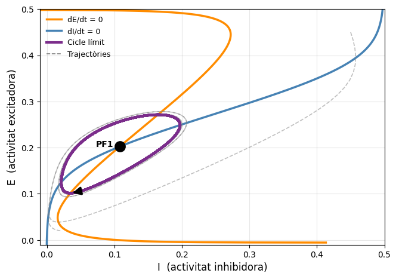

# Anàlisi de la dinàmica de poblacions neuronals: El model de Wilson-Cowan aplicat a l'activitat epilèptica

Aquest repositori conté el codi font, simulacions i la documentació del Treball de Final de Grau (TFG) del **Grau en Matemàtica Computacional i Analítica de Dades**.

---

## Descripció del Projecte

Aquest treball analitza la dinàmica no lineal de poblacions neuronals acoblades mitjançant el **model de Wilson-Cowan**. L'objectiu principal és estudiar com certs canvis en els paràmetres del sistema (com el nivell d'excitació o inhibició) poden provocar transicions cap a estats d'activitat epilèptica (biestabilitat i oscil·lacions d'alta freqüència).

### Principals aspectes tractats:
* Simulació de les equacions diferencials del model de Wilson-Cowan en **Python**.
* Anàlisi de punts fixos i estabilitat (matriu jacobiana).
* Identificació de **bifurcacions d'Andronov-Hopf** i zones de biestabilitat/histèresi.
* Mètodes numèrics de continuació per a la cerca de solucions periòdiques i cicles límit.

---

## Resultats Destacats

| Diagrama de Bifurcació | Retrat de Fase / Cicle Límit |
| :---: | :---: |
|  |  |

---

## Estructura del Repositori

* `docs/`: Conté el document complet del TFG en format PDF.
* `src/`: Scripts de Python amb la implementació dels mètodes numèrics i simulacions.
* `figures/`: Gràfiques i diagrames generats durant l'estudi.

---

## Documentació Completa

Pots llegir el Treball de Final de Grau complet en PDF [aquí](docs/tfg_JuliaMoran.pdf).

---

## Tecnologies Utilitzades

* **Llenguatge:** Python
* **Llibreries principals:** `NumPy`, `SciPy` (mètodes d'integració i arrels), `Matplotlib` (visualització).
